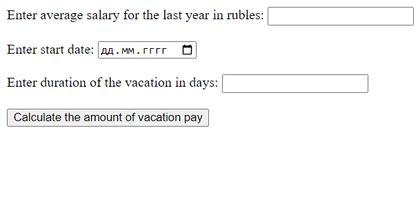

## Vacation pay calculator

The application asks to input the average salary for the last 12 months and the number of vacation days. Then responds with the amount of vacation pay that will come to the employee. It is possible to specify the vacation start date (holidays are taken into account when calculating).

## Technologies

- **Java 17**
- **Spring Boot 2.7.8**
- **Maven**

## Application Interaction

## Launching the application

- install **Java 17+**
- download jar-file and configuration file from Releases
- start application by running jar from command line: java -jar VacationPayCalculator.jar
- go to http://localhost:8080/ in the browser